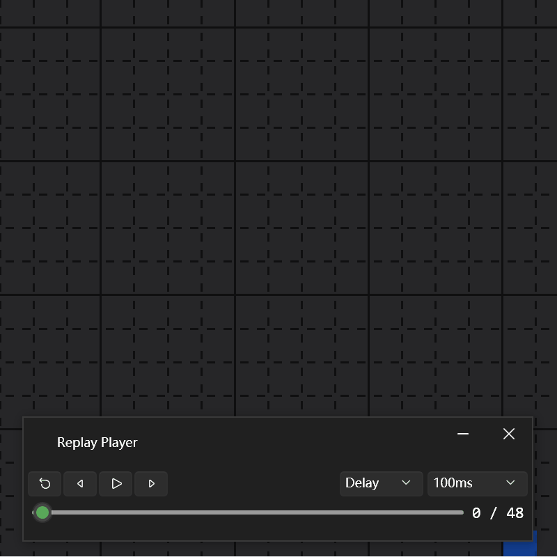
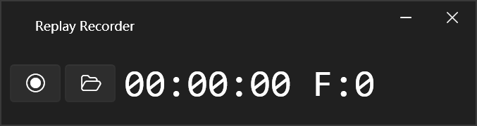
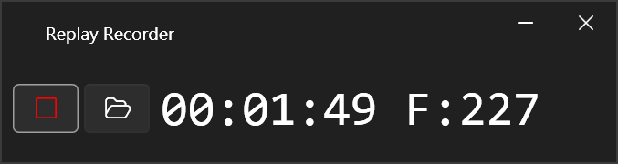
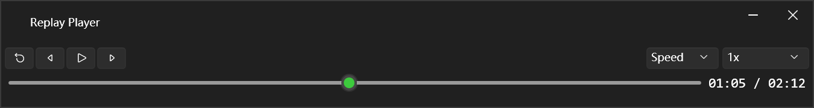
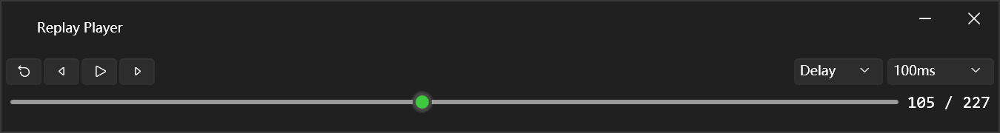

# TEdit Replay Plugin

A record-and-replay plugin for [TEdit](https://github.com/BinaryConstruct/Terraria-Map-Editor). Capture your building process and play it back, great for making timelapse videos.

一个 TEdit 录制与回放插件，用于录制世界编辑操作并回放，适合制作建筑延时视频。

## Features / 功能

- **Record** operations as frames
- **Playback** in two modes:
  - **Speed** — replay at original timing, with adjustable speed multiplier
  - **Delay** — step through frames at a fixed interval
- **Seek** — drag the progress bar to jump to any point
- **Step** — move forward / backward one frame at a time

- **录制** 将操作记录为帧
- **回放** 支持两种模式：
  - **Speed** — 按原始时间回放，可调节倍速
  - **Delay** — 按固定间隔逐帧播放
- **定位** — 拖动进度条跳转到任意位置
- **步进** — 逐帧前进 / 后退

## Usage / 使用方法

1. Open a world in TEdit, then click `Plugins -> Replay`;
2. Click the record button to start recording;
3. Your editing operations will now be recorded;
4. Click the stop button to stop recording;
5. Choose a save location;
6. Click the open button to play a saved `.TEditReplay` file;

1. 在 TEdit 中打开世界，然后点击 `插件 -> Replay`；
2. 点击录制按钮开始录制；
3. 此时编辑世界的行为将会被记录；
4. 点击结束按钮结束录制；
5. 选择保存位置；
6. 点击文件按钮播放保存的 `.TEditReplay` 录像文件；

| Button 按钮 | Action 行为 |
|---|---|
| ◀ | Jump to start 跳到开头 |
| \|◀ | Step backward 向后步进 |
| ▶ / ❚❚ | Play / Pause 播放 / 暂停 |
| ▶\| | Step forward 向前步进 |
| Speed / Delay | Playback mode 播放模式 |
| Rate | Speed multiplier or delay interval 播放倍率或间隔时间 |
